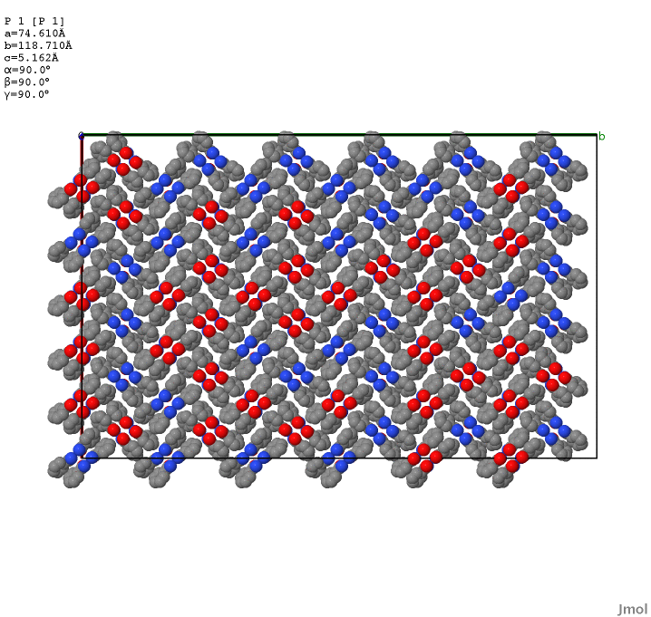

# MOL2LAMMPS
A set of open-source conversion scripts than enable a user to generate input files for the molecular dynamics code LAMMPS.

### MOL2LAMMPS was built with the intention to streamline creating LAMMPS input files specifically for molecular crystals in a similar manner to the same functionality in commercial softwares without the use of a GUI.

## Note: the MOL2LAMMPS toolkit is legacy software and was written using python2.7 and has not been updated since 2018.
## the codes were setup on my 2010 macbook pro and work fine from there. 

For setup and installation please refer to the documentation MOL2LAMMPS.pdf

Below are some example screenshots of simualtions that were created with the help of MOL2LAMMPS I did make quite extensive use 
of the tool for my research contributions.   

####  MD Deformation of paracetamol III

#### Simualtion of occuptional disorder in benzamide crystal.

